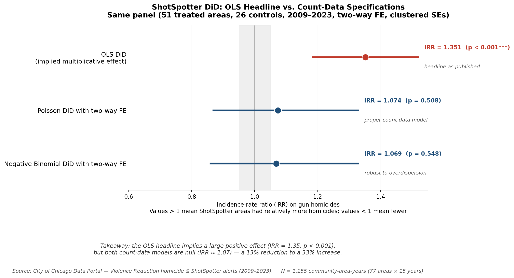
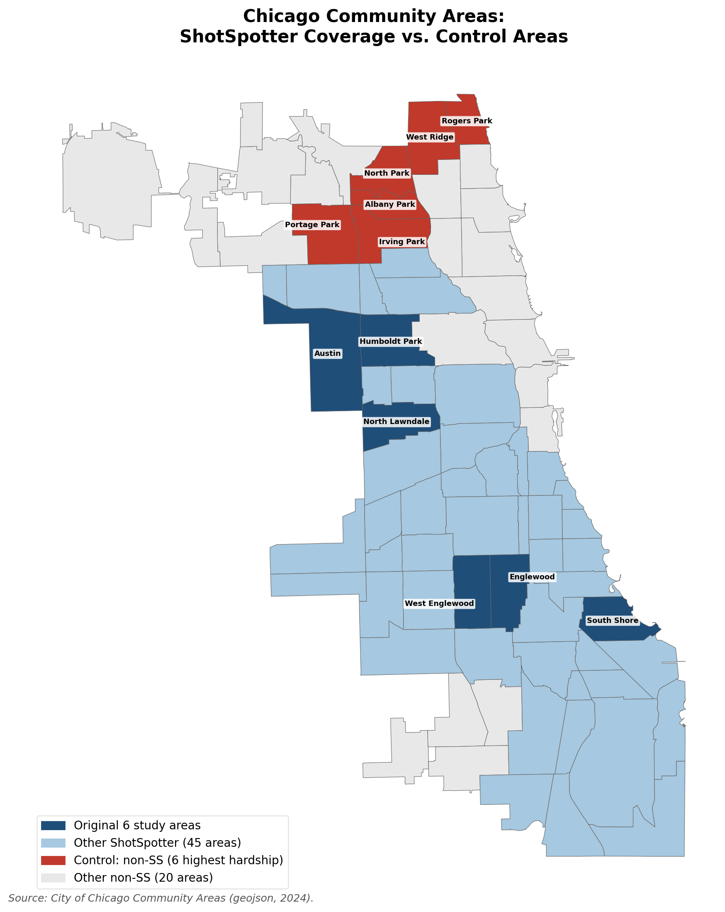
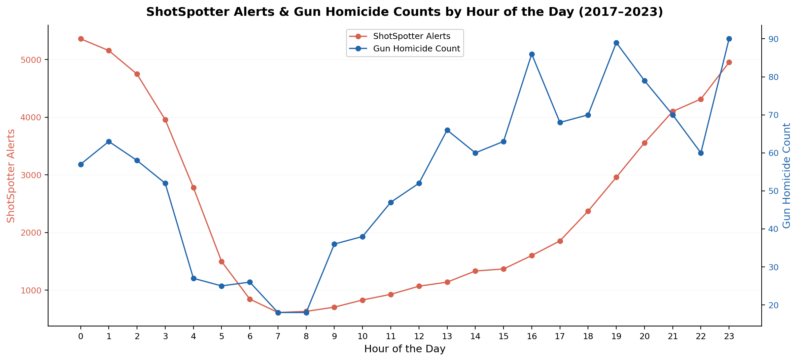
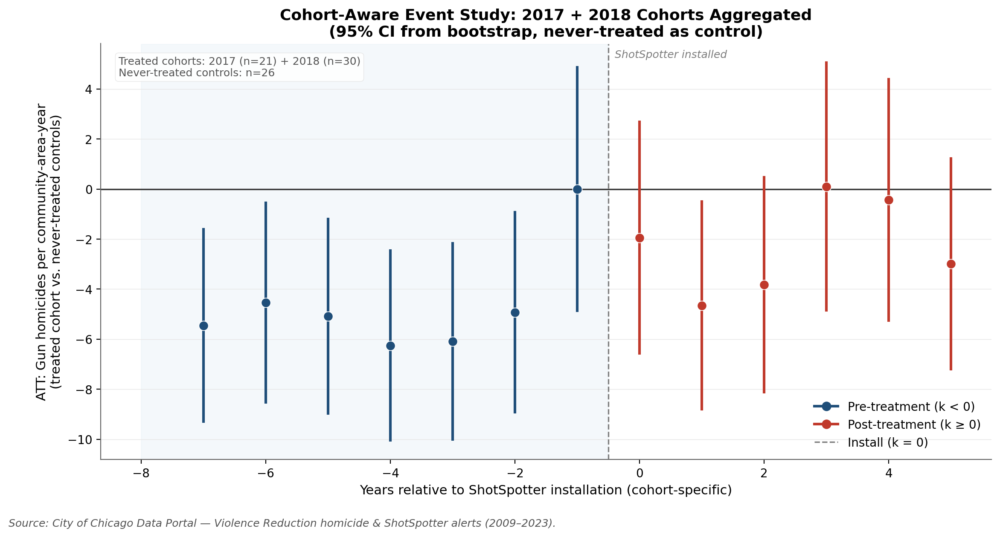
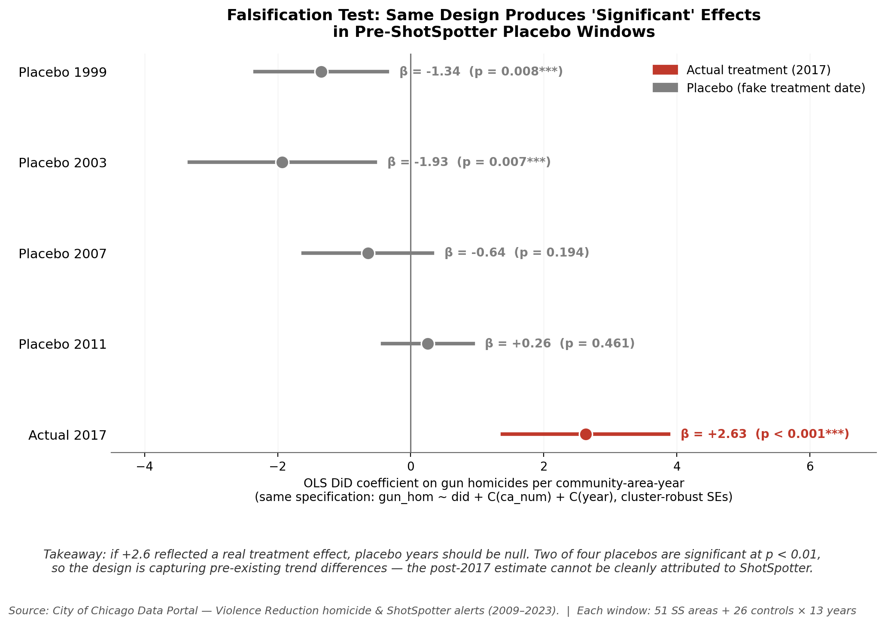
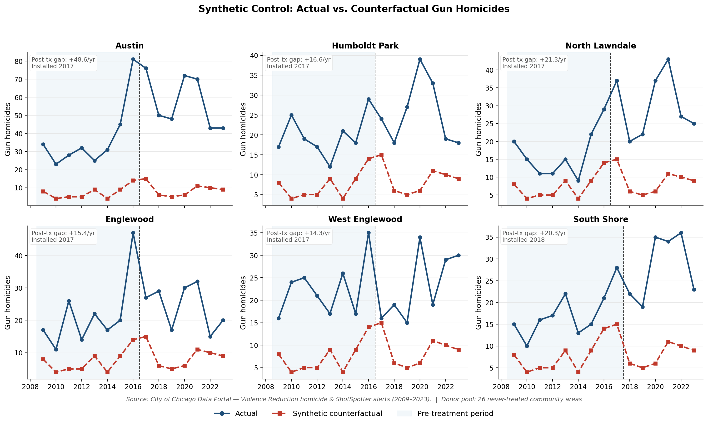
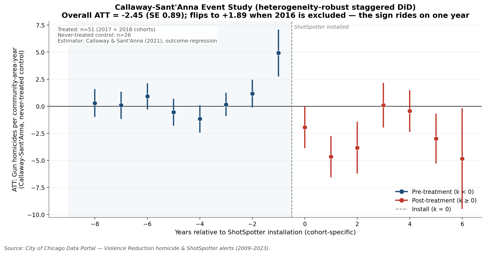

# ShotSpotter & Gun Homicide in Chicago — A Difference-in-Differences Study


**The question.** Did Chicago's ShotSpotter gunshot-detection system — deployed
across 51 of 77 community areas in 2017–2018 and cancelled in 2023 — actually
reduce gun homicides?

**The finding.** No — and, more importantly, *the data cannot credibly show that it
did or didn't.* A naive difference-in-differences says ShotSpotter areas saw **more**
gun homicides (+2.6 per area-year, p < 0.001). But that headline is a statistical
artifact: it evaporates the moment homicide *counts* are modeled correctly, it fails
a parallel-trends test, it reproduces equally "significant" effects when treatment is
faked in pre-rollout years, and it has no valid synthetic-control comparison.
ShotSpotter worked as a *detector* of gunfire; the claim that it *reduced* gun
homicides does not survive scrutiny.

**How I get there** — and how you can reproduce it from the data and code below — is a
sequence of increasingly demanding causal-inference designs on a community-area × year
panel of Chicago gun homicides, 2009–2023. The figures below walk the evidence in
order; [NARRATIVE.md](NARRATIVE.md) is the full write-up.



*The whole story in one figure. The OLS effect is the additive +2.63 coefficient shown
on the multiplicative scale for comparison (implied IRR ≈ 1.35, p < 0.001); the Poisson
and Negative Binomial points are genuinely-estimated incidence-rate ratios. Both
count-data models collapse the headline to a statistically null IRR ≈ 1.07.*

## Headline result at a glance

| Specification | Estimate | 95% CI | p |
|---|---|---|---|
| **OLS DiD** | +2.63 gun homicides / area-year | [+1.38, +3.88] | **<0.001*** |
| **Poisson DiD** (two-way fixed effects) | IRR 1.07 | [0.87, 1.33] | 0.51 (ns) |
| **Negative Binomial DiD** (dispersion estimated) | IRR 1.07 | [0.86, 1.33] | 0.55 (ns) |

The +2.63 OLS coefficient is *robust* to adding community-area and year fixed
effects — it does **not** come from a missing-controls problem. It comes from
modeling integer homicide counts as a continuous, homoscedastic outcome. On the
natural multiplicative (count-data) scale, the effect is statistically null.

The full write-up is in **[NARRATIVE.md](NARRATIVE.md)**; the formatted paper is
**[paper/final_paper.pdf](paper/final_paper.pdf)**. Regenerable result tables live in
[docs/results_summary_original.md](docs/results_summary_original.md) (original pipeline)
and [docs/results_summary_reanalysis.md](docs/results_summary_reanalysis.md)
(re-analysis + robustness).

## Methods & skills demonstrated

- **Causal inference:** difference-in-differences (pooled and two-way fixed
  effects), Callaway–Sant'Anna heterogeneity-robust staggered DiD, cohort-specific
  event study, synthetic control with in-space permutation inference, pre-period
  placebo / falsification tests.
- **Count-data econometrics:** Poisson and Negative Binomial regression (with the
  dispersion estimated), incidence-rate ratios, clustered standard errors.
- **Robustness & diagnostics:** joint parallel-trends Wald test, COVID- and
  2016-sensitivity checks, multiple-specification forest plots.
- **Geospatial analysis:** GeoPandas, choropleth and kernel-density hotspot maps,
  CRS-correct metric grids (EPSG:26971), `contextily` basemaps.
- **Python data stack:** pandas, NumPy, statsmodels, SciPy, matplotlib, seaborn.
- **Reproducible research:** a relative-path pipeline that runs from any clone,
  scripted figure generation, and documented data provenance.

## How the analysis works

### 1. The setting: ShotSpotter was deployed where violence already was



ShotSpotter coverage (blue) blankets the high-violence South and West sides, while the
never-treated areas sit elsewhere in the city. Before deployment, the 51 covered areas
averaged roughly **4.6 times** the gun homicides *per area* of the 26 uncovered ones
(about nine times in aggregate, since there are nearly twice as many covered areas).
Treatment was assigned *because of* violence, not at random — which is the central
problem every design here has to confront, and the reason the comparison leans
entirely on the parallel-trends assumption.

### 2. As a detector, the technology works



ShotSpotter alerts and gun homicides rise and fall together over the day — both
bottoming out mid-morning and peaking late at night — and they peak in the same summer
months. The system detects the gunfire it is designed to detect. The question is
whether *detection* translated into *fewer homicides*.

### 3. The headline says "more homicides" — but it is a modeling artifact

The two-way fixed-effects OLS DiD returns **+2.63 gun homicides per area-year
(p < 0.001)**. That number is robust to fixed effects, COVID exclusions, and dropping
2016 — so it looks bulletproof. It is not. Annual homicide counts are small
non-negative integers whose variance grows with their mean; OLS treats them as
continuous and equal-variance. Estimated with the right model for counts — Poisson and
Negative Binomial with the same fixed effects — the effect is **statistically null**: a
small, non-significant *positive* point estimate (IRR ≈ 1.07, p ≈ 0.5; see the headline
figure above), not the dramatic +2.6 the additive scale implies. The count models agree
with OLS in *direction* but shrink the effect to noise on the natural multiplicative
scale.

### 4. Parallel trends fail



In this cohort event study every pre-treatment coefficient is large and negative — an
artifact of 2016 (a Chicago-wide homicide-record year) sitting next to the base period.
The robust evidence is a joint Wald test on the pre-treatment coefficients, which is
invariant to the base year and rejects parallel trends (F = 19.9, p = 0.006). Once the
design fails this test, the DiD contrast cannot be read as causal.

### 5. Fake treatment dates produce the same "effect"



If +2.6 were a real treatment effect, assigning *fake* treatment dates years before
ShotSpotter existed should yield nothing. Instead, the 1999 and 2003 placebos come back
statistically significant (p < 0.01) and of comparable magnitude (β = −1.34 and −1.93).
They are opposite-signed, but that is the point: a design that manufactures "significant"
effects in years before the program existed is capturing pre-existing trend differences
across neighborhoods, not the intervention.

### 6. There is no valid comparison group (synthetic control)



For every study neighborhood, the synthetic counterfactual (red) sits far below the
actual series (blue) — even in the pre-treatment window it was explicitly fit on. No
weighted combination of the 26 never-treated, lower-violence areas can reproduce a
high-violence treated unit, so the optimizer collapses onto a single donor and the
method is **infeasible**. The city left no comparable untreated neighborhood; the
absence of a counterfactual is itself the finding.

### 7. The "modern estimator" sign rides on a single year



The gold-standard estimator for staggered rollouts — Callaway & Sant'Anna (2021) —
returns an overall ATT of **−2.45 (p < 0.01)** on the full panel, the *opposite* sign of
OLS. But that negative is not a property of the method: it is driven almost entirely by
the 2016 record-homicide year sitting at the *k* = −1 baseline. **Exclude 2016 and the
same estimator returns +1.90 (p < 0.01) — back to the sign of OLS.** The event study
makes this visible: only the *k* = −1 (2016) pre-coefficient is significant; the rest
hover at zero.

So read honestly, the estimators do not show a mysterious "method-determined sign":

| Estimator | Full panel | What actually moves it |
|---|---|---|
| Naive OLS DiD | **+2.63** (p < 0.001) | additive scale, inflated by high-count areas |
| Poisson / Neg. Binomial | IRR ≈ **1.07** (ns) | positive in sign, but null on the multiplicative scale |
| Callaway–Sant'Anna | **−2.45** (p < 0.01) | flips to **+1.90** once the 2016 outlier year is dropped |

OLS and the count models actually agree in *direction* (both positive); only Callaway–
Sant'Anna goes negative, and only because of one anomalous year. The real lesson is not
"any answer is possible," but that every estimate is dominated by a single outlier year
on top of a design with **no valid control group** (Step 6) and a **failed pre-trend
test** (Step 4). With no clean counterfactual, the causal effect is simply **not
identifiable from these data** — in either direction.

## Bottom line

ShotSpotter did what it was built to do — *detect* gunfire that 911 calls miss. But
across every design that respects the data, there is **no credible evidence of an effect
on gun homicides in either direction**. The honest reading is neither "ShotSpotter
increased violence" (the +2.6 is an artifact of the additive scale) nor "ShotSpotter cut
violence" (that reads a 2016-driven CS estimate too literally) — it is that, with no
valid control group and a pre-period dominated by one outlier year, **these data simply
cannot identify a causal effect**. They are also inconsistent with the large reduction a
$3M detection contract was meant to deliver. That non-result is itself the policy
finding, and it is consistent with the city's 2023 decision to end the contract. Full argument and
limitations: [NARRATIVE.md](NARRATIVE.md).

## Limitations & next steps

I'd rather name the soft spots than have a reviewer find them:

- **The identification ceiling is the data, not just the method.** Chicago deployed
  ShotSpotter in *every* high-violence neighborhood, so there is no untreated unit at
  the treated units' violence level. No estimator can manufacture a counterfactual the
  data don't contain — which is why the synthetic control is reported as *infeasible*
  rather than as a result.
- **Two event-study implementations.** The cohort event study in
  `econometric_analysis.py` is a transparent hand-rolled difference-in-means with a
  bootstrap; `did_callaway_santanna.py` is the packaged, heterogeneity-robust
  Callaway–Sant'Anna estimator and should be treated as the authoritative
  staggered-DiD result. The former is kept for intuition, not as the final word.
- **Inference.** Standard errors cluster on community area (~77 clusters); a
  wild-cluster bootstrap would be more conservative with this few clusters.
- **Non-fatal shootings** are still estimated under OLS; re-estimating them as a count
  model (as done for homicides) is the natural next step and is unlikely to change the
  qualitative picture.
- **Scope.** The panel is annual (masking within-year dynamics), and the analysis
  observes neither police response times, dispatch decisions, nor arrests — the actual
  channel through which detection could plausibly reduce violence.

## Repository layout

```
.
├── README.md
├── NARRATIVE.md                       Full write-up of findings and caveats
├── LICENSE
├── requirements.txt
│
├── data/
│   ├── raw/                           City of Chicago portal inputs (large files
│   │                                  git-ignored — see "Data" below)
│   └── processed/                     Cleaned subsets produced by notebooks/clean_*.ipynb
│
├── notebooks/                         Jupyter notebooks (cleaning + spatial work)
│   ├── clean_homicides_shotspotter.ipynb
│   ├── clean_poverty.ipynb
│   ├── heatmap.ipynb
│   └── murder_map.ipynb
│
├── scripts/                           Standalone Python analysis pipeline
│   ├── plot_style.py                  Shared academic-paper style (palette, helpers)
│   ├── did_analysis.py                OLS DiD, event study, t-tests
│   ├── econometric_analysis.py        TWFE DiD, cohort event study, synthetic control
│   ├── econometric_robustness.py      Poisson/NegBin DiD, pre-trend Wald, permutation SC
│   ├── did_callaway_santanna.py       Callaway–Sant'Anna heterogeneity-robust DiD
│   ├── make_narrative_plots.py        Specification-comparison + falsification figures
│   ├── make_pretty_plots.py           Descriptive figures (monthly, hourly, hotspots)
│   └── plot_covid_sensitivity.py
│
├── plots/                             All generated figures (PNG, 200 DPI)
├── paper/
│   └── final_paper.pdf                Formatted paper
└── docs/
    ├── results_summary_original.md    Original DiD tables (from did_analysis.py)
    ├── results_summary_reanalysis.md  Re-analysis + robustness tables (econometric_*.py)
    ├── Pov_data_table.docx            Poverty summary table (generated by clean_poverty.ipynb)
    └── shotspotter_analysis.docx      Original course write-up
```

## Data

All inputs are public products of the [Chicago Data Portal](https://data.cityofchicago.org/):

| File (in `data/raw/`) | Source | In repo? |
|---|---|---|
| `Violence_Reduction_-_Victims_of_Homicides_and_Non-Fatal_Shootings_*.csv` | [Victims of Homicides & Non-Fatal Shootings](https://data.cityofchicago.org/Public-Safety/Violence-Reduction-Victims-of-Homicides-and-Non-Fa/gumc-mgzr/about_data) | No — download |
| `Violence_Reduction_-_Shotspotter_Alerts_-_Historical_*.csv` | [ShotSpotter Alerts (Historical)](https://data.cityofchicago.org/Public-Safety/Violence-Reduction-Shotspotter-Alerts-Historical/3h7q-7mdb/about_data) | No — download |
| `transportation_*.csv` | [Transportation network](https://data.cityofchicago.org/Transportation/transportation/7ez8-272k/about_data) (street overlays only) | No — download |
| `CommAreas_*.geojson` | [Community Areas](https://data.cityofchicago.org/Facilities-Geographic-Boundaries/Boundaries-Community-Areas-current-/cauq-8yn6) | Yes |
| `Census_Data_-_Selected_socioeconomic_indicators_*.csv` | [Census — socioeconomic indicators](https://data.cityofchicago.org/Health-Human-Services/Census-Data-Selected-socioeconomic-indicators-in-C/kn9c-c2s2/about_data) | Yes |

The three large raw files (~110 MB combined) are **git-ignored** to keep the
repository lightweight and to avoid re-hosting victim-level data. They are freely
re-downloadable from the links above — drop them into `data/raw/`. The analysis never
uses the victim-name columns; the cleaned files in `data/processed/` contain only
aggregated, de-identified fields.

## Reproducing the analysis

```bash
# 1. Install dependencies
pip install -r requirements.txt

# 2. Download the three git-ignored raw files into data/raw/ (see "Data" above).

# 3. (Optional) regenerate the cleaned subsets in data/processed/ by running the
#    notebooks under notebooks/. The committed copies are already sufficient for
#    the descriptive scripts; the regression scripts read directly from data/raw/.

# 4. Original DiD pipeline (writes docs/results_summary_original.md + figures)
python scripts/did_analysis.py

# 5. Re-analysis + robustness (TWFE, count-data, synthetic control,
#    pre-period falsification, permutation inference, Callaway–Sant'Anna)
python scripts/econometric_analysis.py
python scripts/econometric_robustness.py
python scripts/did_callaway_santanna.py    # needs the `differences` package

# 6. Narrative + descriptive figures
python scripts/make_narrative_plots.py
python scripts/make_pretty_plots.py
python scripts/plot_covid_sensitivity.py
```

Every script resolves paths relative to its own location, so the pipeline runs from any
clone with no path edits. (The hotspot maps fetch basemap tiles over the network via
`contextily`; they degrade gracefully to no-basemap when offline.)

## Contact

Austin Belman — abelma2@illinois.edu

## License

MIT — see [LICENSE](LICENSE).
