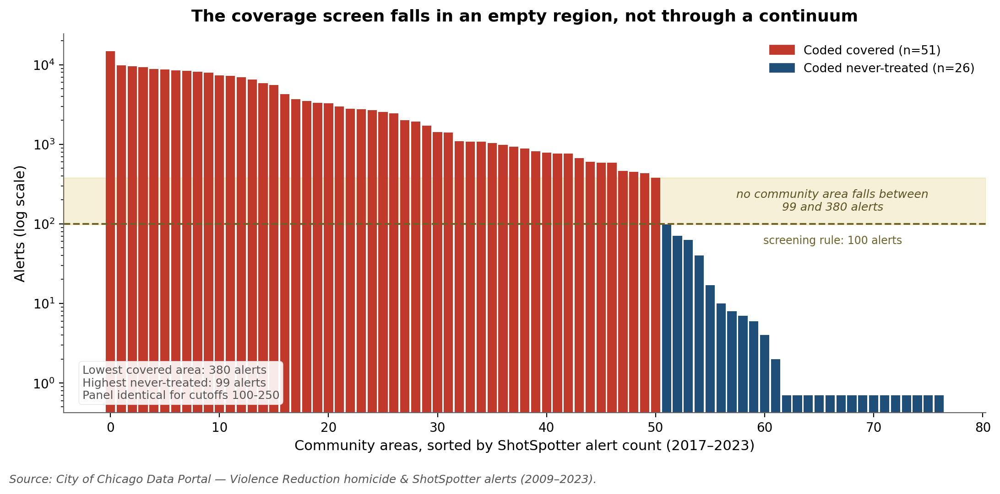
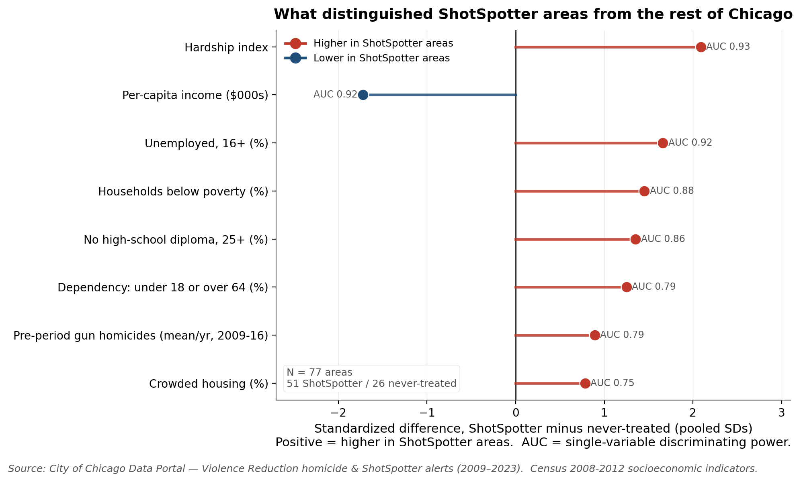
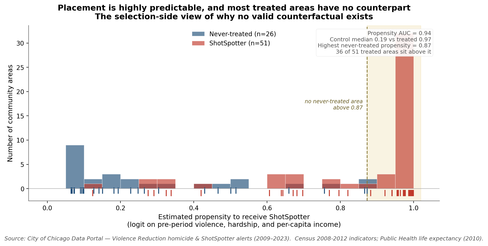
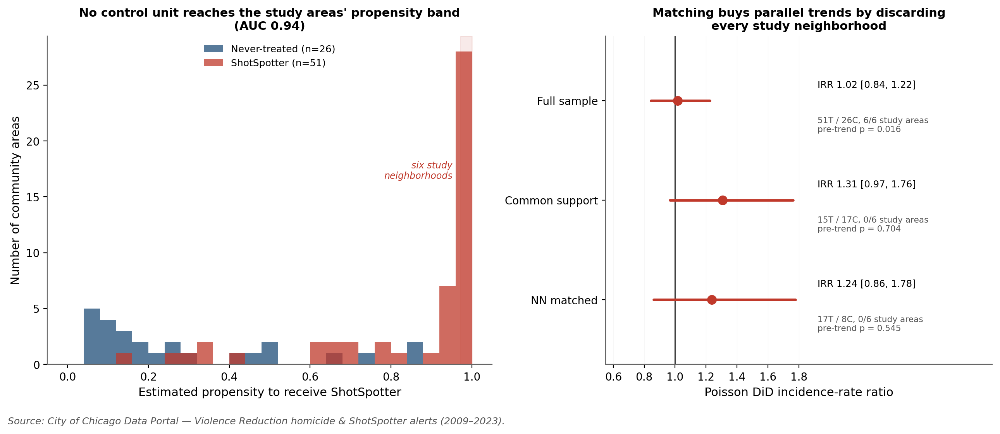
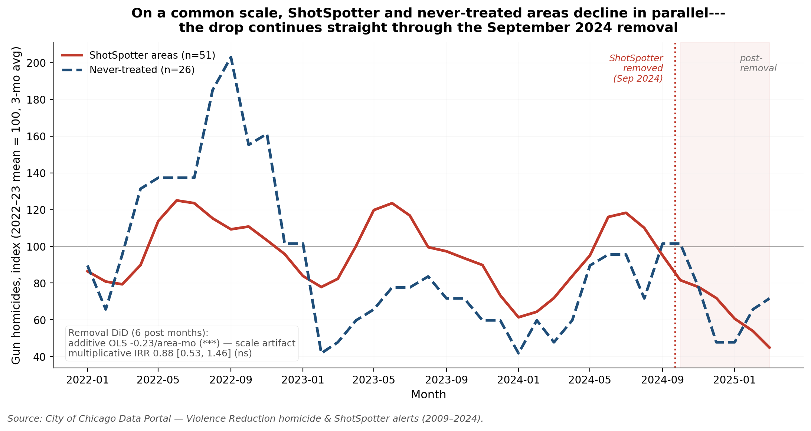

# Detection Without Identification: ShotSpotter & Gun Homicide in Chicago


**The general problem.** Cities do not site place-based programs at random; they install
them where the problem is worst. This project diagnoses the evaluation failure that follows
when that targeting is both tight and near-complete, a configuration we call **saturation
targeting**: assignment is predicted by the same structural variables that predict the
outcome, *and* coverage among units above the operative risk threshold approaches one. The
units left untreated are then not a noisy comparison group but a group drawn from a region
of the covariate space containing none of the units the evaluation is about, so the effect
for those units is not a parameter the data contain.

**The contribution.** That failure leaves **three signatures, each testable on public data
before any effect is estimated**, and the modern difference-in-differences toolkit repairs
none of them, because it corrects weighting under heterogeneous treatment timing rather than
missing overlap. Chicago's ShotSpotter rollout is the worked case: 51 of 77 community areas
covered in 2017–2018, cancelled in 2023, switched off in 2024.

| | Signature | What it looks like here |
|---|---|---|
| 1 | An additive estimator reporting the baseline gap | OLS DiD **+2.63** (p < 0.001), robust to fixed effects and a wild-cluster bootstrap, yet null on the count scale (**IRR ≈ 1.07**; heterogeneity-robust ETWFE **1.05** [0.79, 1.33]) |
| 2 | Instability that is *not* a timing problem | Parallel trends rejected (**F = 19.9**, p = 0.006); pre-rollout placebos "significant"; Callaway–Sant'Anna flips **−2.45 → +1.90** on one year, while Goodman–Bacon puts only **4.6%** of weight on forbidden comparisons |
| 3 | No overlap | Propensity AUC **0.94**; no never-treated area exceeds **0.873**, and **36 of 51** covered areas sit above every one of them |

**The sharpest methodological point.** The staggered-adoption literature has taught applied
researchers to reach for a heterogeneity-robust estimator when two-way fixed effects look
unstable. Those estimators fix *weighting*; under saturation targeting the binding
constraint is *missing overlap*, so a corrected estimate is no better identified than the
one it replaces. The Goodman–Bacon decomposition is what lets you tell the two apart.

**What this is not.** That gunshot detection does not reduce gun violence is the weight of
prior evidence (Connealy et al. 2024; Doucette et al. 2021; Huff, Dunlap & Pearson 2026), not
a claim of ours. Our estimates rule out a large *deterrence* effect but cannot exclude the
smaller survival-channel benefit a boundary regression discontinuity attributes to faster
emergency response, which sits inside our interval. **A non-identification of this kind is
not a null result.** It is a statement about what the assignment mechanism left in the data.

The formatted paper is [paper/final_paper.pdf](paper/final_paper.pdf);
[NARRATIVE.md](NARRATIVE.md) is the long-form write-up. Everything below reproduces from the
data and code in this repository.


*The whole story in one figure. The OLS effect is the additive +2.63 coefficient shown
on the multiplicative scale for comparison (implied IRR ≈ 1.35, p < 0.001); the Poisson
and Negative Binomial points are genuinely-estimated incidence-rate ratios. Both
count-data models collapse the headline to a statistically null IRR ≈ 1.07.*

## Headline result at a glance

| Specification | Estimate | 95% CI | p |
|---|---|---|---|
| **OLS DiD** | +2.63 gun homicides / area-year | [+1.38, +3.88] | **<0.001*** |
| **Poisson DiD** (two-way fixed effects) | IRR 1.07 | [0.87, 1.33] | 0.51 (ns) |
| **Negative Binomial DiD** (dispersion estimated) | IRR 1.07 | [0.86, 1.33] | 0.55 (ns) |
| **ETWFE-Poisson** (Wooldridge 2023, heterogeneity-robust) | IRR 1.05 | [0.79, 1.33] | ns |

The +2.63 OLS coefficient is *robust* to adding community-area and year fixed
effects; it does **not** come from a missing-controls problem. It comes from
modeling integer homicide counts as a continuous, homoscedastic outcome. On the
natural multiplicative (count-data) scale, the effect is statistically null.

The +2.63 collapses to the same null under the heterogeneity-robust count estimator the
staggered-rollout literature calls for (a Wooldridge 2023 ETWFE-Poisson), so it is not an
artifact of the plain Poisson's fixed-effects weighting.

The full write-up is in **[NARRATIVE.md](NARRATIVE.md)**; the formatted paper is
**[paper/final_paper.pdf](paper/final_paper.pdf)**. Regenerable result tables live in
[docs/results_summary_original.md](docs/results_summary_original.md) (original pipeline),
[docs/results_summary_reanalysis.md](docs/results_summary_reanalysis.md)
(re-analysis + robustness),
[docs/results_summary_placement.md](docs/results_summary_placement.md)
(treatment-assignment / equity model),
[docs/results_summary_etwfe.md](docs/results_summary_etwfe.md) (ETWFE robustness), and
[docs/results_summary_removal.md](docs/results_summary_removal.md) (the September 2024
removal experiment).

## Methods & skills demonstrated

- **Causal inference:** difference-in-differences (pooled and two-way fixed
  effects), Callaway–Sant'Anna heterogeneity-robust staggered DiD, cohort-specific
  event study, synthetic control with in-space permutation inference, pre-period
  placebo / falsification tests, and a second natural experiment exploiting the
  September 2024 ShotSpotter shutoff.
- **Selection / treatment-assignment modeling:** cross-sectional linear-probability
  and logistic models of *which* neighborhoods got ShotSpotter, standardized-effect
  balance tables, propensity-score overlap / common-support diagnostics, and an equity
  test of whether racial composition predicts placement conditional on violence and
  disadvantage.
- **Count-data econometrics:** Poisson and Negative Binomial regression (with the
  dispersion estimated), incidence-rate ratios, clustered standard errors, and a
  Wooldridge (2023) extended two-way fixed-effects Poisson (the heterogeneity-robust
  count analog of Callaway–Sant'Anna).
- **Overlap / common-support analysis:** propensity trimming and 1:1 nearest-neighbour
  matching with a caliper, re-testing pre-trends on each restricted sample to show what
  matching buys and what it costs.
- **Robustness & diagnostics:** joint parallel-trends Wald test, COVID- and
  2016-sensitivity checks, restricted wild-cluster bootstrap, Goodman–Bacon decomposition,
  treatment-threshold sensitivity, multiple-specification forest plots.
- **Reproducibility engineering:** `scripts/check_consistency.py`, a stdlib-only test suite
  that re-reads the source-of-truth result docs and asserts the paper states those numbers,
  verifies every occurrence of a confidence interval carries the same point estimate, and
  checks reference integrity and style. Validated by deliberately re-introducing three past
  regressions and confirming each is caught.
- **Geospatial analysis:** GeoPandas, choropleth and kernel-density hotspot maps,
  CRS-correct metric grids (EPSG:26971), `contextily` basemaps.
- **Python data stack:** pandas, NumPy, statsmodels, SciPy, matplotlib, seaborn.
- **Reproducible research:** a relative-path pipeline that runs from any clone,
  scripted figure generation, and documented data provenance.

## How the analysis works

The walkthrough below follows the argument in the paper: the setting, then the three
signatures in order, then a replication of the whole pattern on an independent event.

### Setting: ShotSpotter was deployed where violence already was


ShotSpotter coverage (blue) blankets the high-violence South and West sides, while the
never-treated areas sit elsewhere in the city. Before deployment, the 51 covered areas
averaged roughly **4.6 times** the gun homicides *per area* of the 26 uncovered ones
(about nine times in aggregate, since there are nearly twice as many covered areas).
Treatment was assigned *because of* violence, not at random, which is the central
problem every design here has to confront, and the reason the comparison leans
entirely on the parallel-trends assumption.

One premise can be settled before the argument starts. As a *measurement instrument*
ShotSpotter works: alerts track gun homicides through the same seasonal and diurnal cycles
([`plots/hourly_pattern.png`](plots/hourly_pattern.png)). Detection is not in question. What
follows asks whether these data can say anything about what that detection did.

**The coverage screen itself is defensible, and we show it rather than assert it.** An area
counts as covered if the alert file shows ≥ 100 alerts spanning ≥ 12 months. That cutoff
falls in an *empty band*: the least-covered treated area records 380 alerts, the
most-covered never-treated area records 99, and no community area falls between them. The
panel is identical for any cutoff from 100 to 250. We also disclose what the screen misses:
only 15 of the 26 never-treated areas record zero alerts, and Washington Heights, the single
donor the synthetic control collapses onto, records 71
([`docs/results_summary_treatment.md`](docs/results_summary_treatment.md)).



### Signature 1. The headline says "more homicides", but it is a scale artifact

The two-way fixed-effects OLS DiD returns **+2.63 gun homicides per area-year
(p < 0.001)**. That number is robust to fixed effects, COVID exclusions, and dropping
2016, so it looks bulletproof. It is not. Annual homicide counts are small
non-negative integers whose variance grows with their mean; OLS treats them as
continuous and equal-variance. Estimated with the right model for counts (Poisson and
Negative Binomial with the same fixed effects) the effect is **statistically null**: a
small, non-significant *positive* point estimate (IRR ≈ 1.07, p ≈ 0.5; see the headline
figure above), not the dramatic +2.6 the additive scale implies. The count models agree
with OLS in *direction* but shrink the effect to noise on the natural multiplicative
scale. And the null is not an artifact of the plain Poisson's fixed-effects weighting under
the staggered rollout: the heterogeneity-robust count estimator the literature prescribes
(a Wooldridge (2023) extended two-way fixed-effects Poisson) returns the same null (overall
ATT IRR 1.05, 95% CI [0.79, 1.33]), with cohort-time effects at one at every horizon.

### Signature 2. The pre-period cannot support parallel trends


In this cohort event study every pre-treatment coefficient is large and negative, an
artifact of 2016 (a Chicago-wide homicide-record year) sitting next to the base period.
The robust evidence is a joint Wald test on the pre-treatment coefficients, which is
invariant to the base year and rejects parallel trends (F = 19.9, p = 0.006). Once the
design fails this test, the DiD contrast cannot be read as causal.

#### Fake treatment dates produce the same "effect"


If +2.6 were a real treatment effect, assigning *fake* treatment dates years before
ShotSpotter existed should yield nothing. Instead, the 1999 and 2003 placebos come back
statistically significant (p < 0.01) and of comparable magnitude (β = −1.34 and −1.93).
They are opposite-signed, but that is the point: a design that manufactures "significant"
effects in years before the program existed is capturing pre-existing trend differences
across neighborhoods, not the intervention.

#### And the modern estimator's sign rides on a single year


The gold-standard estimator for staggered rollouts, Callaway & Sant'Anna (2021),
returns an overall ATT of **−2.45 (p < 0.01)** on the full panel, the *opposite* sign of
OLS. But that negative is not a property of the method: it is driven almost entirely by
the 2016 record-homicide year sitting at the *k* = −1 baseline. **Exclude 2016 and the
same estimator returns +1.90 (SE 0.72), back to the sign of OLS.** The event study
makes this visible: only the *k* = −1 (2016) pre-coefficient is significant; the rest
hover at zero.

So read honestly, the estimators do not show a mysterious "method-determined sign":

| Estimator | Full panel | What actually moves it |
|---|---|---|
| Naive OLS DiD | **+2.63** (p < 0.001) | additive scale, inflated by high-count areas |
| Poisson / Neg. Binomial | IRR ≈ **1.07** (ns) | positive in sign, but null on the multiplicative scale |
| Callaway–Sant'Anna | **−2.45** (p < 0.01) | flips to **+1.90** once the 2016 outlier year is dropped |

OLS and the count models actually agree in *direction* (both positive); only Callaway–
Sant'Anna goes negative, and only because of one anomalous year. The real lesson is not
"any answer is possible," but that every estimate is dominated by a single outlier year
on top of a design with **no valid control group** (Signature 3) and a **failed pre-trend
test** (Signature 2). With no clean counterfactual, the causal effect is simply **not
identifiable from these data**, in either direction.

### Signature 3. Placement was near-deterministic, so no counterfactual exists



Why is there no counterfactual? Because treatment was *nearly deterministic*. A
cross-sectional model of ShotSpotter placement across all 77 community areas shows that
structural disadvantage, the hardship index (AUC 0.93) and low per-capita income (0.92),
separates covered from uncovered areas even more sharply than the pre-period gun-homicide
*count* itself (0.79). And placement mapped onto Chicago's racial geography: ShotSpotter
areas are on average **49% Black and 32% Hispanic, versus 14% and 17%** in never-treated
areas, and (conditional on violence, hardship, and income) a one-SD increase in the Black
share still raises the probability of placement by +33 points (p = 0.002) and the Hispanic
share by +28 (p = 0.003). Race, hardship, and violence are deeply entangled in a segregated
city, so this is a descriptive pattern, not proof that race drove siting *independently* of
disadvantage, but it is the concentrated-surveillance pattern the MacArthur Justice Center
and the city's Inspector General already documented; our marginal addition is the
*conditional* result (race predicts placement even after violence and hardship are held fixed).



The consequence for identification is stark. A propensity model separates the two groups
with an AUC of 0.94, and **36 of the 51 covered areas sit at a placement propensity above
every one of the 26 never-treated areas** (no never-treated area exceeds 0.87, while 35
covered areas sit at 0.90 or higher, against 0 of 26 never-treated). Those 36 areas span 0.6
to 37.4 gun homicides per year, so the overlap failure is not confined to the violence tail;
hardship drives it too. The six study neighborhoods carried over from the original analysis,
used as illustrative synthetic-control panels in the next step, all sit at a propensity of at
least 0.97, and so do several covered areas outside that set. This is the selection-side
view of the next step: the city installed ShotSpotter in essentially every highest-violence,
highest-hardship neighborhood, leaving no comparable untreated unit from which to build a
counterfactual. (Racial composition is measured from the 2019–2023 ACS, a proxy for the
persistent pre-rollout composition.)

#### Matching restores parallel trends, at the cost of the units in question



The natural response to a failing pre-trend test is to match on pre-treatment observables
first. We ran exactly that, and the result is the sharpest statement of the problem in the
project: **matching works, and the price is the finding.** Trimming to the propensity
common-support region does restore parallel trends (the joint pre-trend Wald test goes from
**F = 2.67, p = 0.016** to **F = 0.66, p = 0.70**). But it discards two thirds of the covered
areas, including *every one* of the six study neighborhoods, because no never-treated area
exists at their propensity level. Only 17 of 51 covered areas find any control inside the
caliper. On the surviving subsample the effect is still null and less precisely estimated
(IRR 1.31 [0.97, 1.76] on common support; 1.24 [0.86, 1.78] matched).

So these data can support a credible comparison, **or** they can speak to the neighborhoods
the policy is about, but not both at once. That is the identification problem stated as a
trade rather than a failure, and it is why no reweighting of the units that exist can supply
a counterfactual for units that have none.

#### Synthetic control is therefore not constructible


The six study neighborhoods shown here are carried over from the original analysis and
serve as illustrative cases, chosen because synthetic control needs a readable number of
panels, not because they are the six most violent coverage areas (three higher-violence
coverage areas sit outside the set, at propensities just as extreme). For each of them the
synthetic counterfactual (red) sits far below the actual series (blue); even in the
pre-treatment window it was explicitly fit on. No
weighted combination of the 26 never-treated, lower-violence areas can reproduce a
high-violence treated unit, so the optimizer collapses onto a single donor and the
method is **infeasible**. The city left no comparable untreated neighborhood; the
absence of a counterfactual is itself the finding.

### Replication with the treatment reversed: the September 2024 removal



Chicago switched ShotSpotter off on 22 September 2024, and the gun-homicide decline that
followed has been read in public commentary as proof the technology never worked. Applying
the same discipline to the *removal* shows it is no more identifiable than the installation,
and it fails in the same two ways, which is the cleanest confirmation of the whole argument.
Gun homicides were already falling city-wide from the 2021–22 peak, in ShotSpotter and
never-treated areas alike (coverage areas **−37%**, never-treated **−31%** over the same
post-removal months), so the raw "crime fell after ShotSpotter left" is a city-wide trend,
not a removal effect. And the additive removal DiD even manufactures a "significant" benefit
(**−0.25 homicides/area-month, p < 0.001**) that vanishes on the multiplicative scale
(**Poisson IRR 0.91, 95% CI [0.54, 1.52]**), the identical scale artifact as the
installation. Both the raw drop and the additive DiD are mirages; the public debate has
confidently drawn both unwarranted inferences.

## Bottom line

ShotSpotter did what it was built to do: *detect* gunfire that 911 calls miss. But
across every design that respects the data, there is **no credible evidence of an effect
on gun homicides in either direction**. The honest reading is neither "ShotSpotter
increased violence" (the +2.6 is an artifact of the additive scale) nor "ShotSpotter cut
violence" (that reads a 2016-driven CS estimate too literally); it is that, with no
valid control group and a pre-period dominated by one outlier year, **these data simply
cannot identify a causal effect**. They rule out a large *deterrence* effect (a broad,
sustained drop in shootings of the kind a $3M detection contract was meant to deliver) but
not the smaller, survival-channel mortality benefit a boundary regression discontinuity
attributes to faster emergency response, a magnitude that falls *inside* the interval this
panel can resolve. The 2024 removal, analyzed the same way, reproduces both failures, so the
non-identification is a property of the setting, not of how the installation happens to be
timed.

**The general lesson is the portable one.** Saturation targeting is not a Chicago
peculiarity or a ShotSpotter peculiarity; it is what competent, need-based allocation looks
like from an evaluator's point of view, and it is becoming more common as cities target
programs with administrative risk scores. Where it holds, the binding constraint is the
assignment mechanism rather than the estimator, and no methodological sophistication applied
after the fact recovers a counterfactual the rollout never generated. The practical
implication is a change in order of operations: **estimate the assignment model first, check
overlap for the units the decision is actually about, and treat that check as a precondition
for estimating an effect rather than as a robustness appendix.** The same arc runs through
the COPS literature (Evans & Owens 2007 → Worrall & Kovandzic 2007 → Mello 2019), where the
dispute was settled not by a better panel estimator but by finding variation the assignment
mechanism did not determine.

Full argument and limitations: [NARRATIVE.md](NARRATIVE.md).

## Limitations & next steps

We'd rather name the soft spots than have a reviewer find them:

- **The identification ceiling is the data, not just the method.** Chicago deployed
  ShotSpotter in *every* high-violence neighborhood, so there is no untreated unit at
  the treated units' violence level. No estimator can manufacture a counterfactual the
  data don't contain, which is why the synthetic control is reported as *infeasible*
  rather than as a result.
- **The placement model is descriptive.** It documents *that* siting tracked disadvantage,
  violence, and racial composition, and quantifies the resulting lack of common support,
  but with 77 heavily collinear units it does not identify a causal assignment rule, and its
  racial-composition measure is the 2019–2023 ACS used as a proxy for the (highly
  persistent) pre-rollout composition.
- **Two event-study implementations.** The cohort event study in
  `econometric_analysis.py` is a transparent hand-rolled difference-in-means with a
  bootstrap; `did_callaway_santanna.py` is the packaged, heterogeneity-robust
  Callaway–Sant'Anna estimator and should be treated as the authoritative
  staggered-DiD result. The former is kept for intuition, not as the final word.
- **Inference.** Standard errors cluster on community area (~77 clusters); a restricted
  wild-cluster bootstrap (999 Rademacher replications) leaves the OLS DiD significant
  (p ≈ 0.001) in every specification; the headline artifact is a *specification* problem,
  not a standard-error problem. A Goodman–Bacon decomposition likewise shows the
  "forbidden" already-treated comparison carries only 4.6% of the staggered TWFE weight,
  so the fragility is the 2016 anomaly and the missing control group, not timing bias.
- **Non-fatal shootings**, re-estimated as count models, tell the same story even more
  starkly: the OLS +7.51 (p = 0.009) flips *below* one and goes statistically null
  (IRR 0.84–0.92, p ≥ 0.23).
- **Scope.** The panel is annual (masking within-year dynamics), and the analysis
  observes neither police response times, dispatch decisions, nor arrests: the actual
  channel through which detection could plausibly reduce violence.

## Repository layout

```
.
├── README.md
├── NARRATIVE.md                       Full write-up of findings and caveats
├── LICENSE
├── requirements.txt
│
├── data/
│   ├── raw/                           City of Chicago portal inputs (large files
│   │                                  git-ignored, see "Data" below)
│   └── processed/                     Cleaned subsets produced by notebooks/clean_*.ipynb
│
├── notebooks/                         Jupyter notebooks (cleaning + spatial work)
│   ├── clean_homicides_shotspotter.ipynb
│   ├── clean_poverty.ipynb
│   ├── heatmap.ipynb
│   └── murder_map.ipynb
│
├── scripts/                           Standalone Python analysis pipeline
│   ├── plot_style.py                  Shared academic-paper style (palette, helpers)
│   ├── did_analysis.py                OLS DiD, event study, t-tests
│   ├── econometric_analysis.py        TWFE DiD, cohort event study, synthetic control
│   ├── econometric_robustness.py      Poisson/NegBin DiD, pre-trend Wald, permutation SC
│   ├── did_callaway_santanna.py       Callaway–Sant'Anna heterogeneity-robust DiD
│   ├── placement_model.py             Treatment-assignment / equity model + propensity overlap
│   ├── robustness_closers.py          NFS count models, wild-cluster bootstrap, Bacon decomposition
│   ├── procedural_benefit.py          Process-vs-outcome test: weapons enforcement DiD (Crimes dataset)
│   ├── etwfe_count.py                 Wooldridge (2023) ETWFE-Poisson: heterogeneity-robust count ATT
│   ├── removal_analysis.py            Sept 2024 shutoff as a second natural experiment (non-identifiable)
│   ├── matched_did.py                 Propensity matching / common support: what it buys and what it costs
│   ├── treatment_definition.py        Coverage-screen diagnostics: threshold sensitivity + control contamination
│   ├── check_consistency.py           Consistency check: paper numbers vs pipeline outputs, refs, style
│   ├── make_narrative_plots.py        Specification-comparison + falsification figures
│   ├── make_pretty_plots.py           Descriptive figures (monthly, hourly, hotspots)
│   └── plot_covid_sensitivity.py
│
├── plots/                             All generated figures (PNG, 200 DPI)
├── paper/
│   ├── final_paper.tex / .pdf         Formatted paper (LaTeX source + PDF)
│   └── methods_memo.tex / .pdf        ~8-page methods-memo version
└── docs/
    ├── results_summary_original.md    Original DiD tables (from did_analysis.py)
    ├── results_summary_reanalysis.md  Re-analysis + robustness tables (econometric_*.py)
    ├── results_summary_placement.md   Placement / equity model tables (placement_model.py)
    ├── results_summary_closers.md     NFS count models, wild bootstrap, Bacon (robustness_closers.py)
    ├── results_summary_procedural.md   Process-vs-outcome / weapons-enforcement DiD (procedural_benefit.py)
    ├── results_summary_etwfe.md        Wooldridge ETWFE-Poisson robustness (etwfe_count.py)
    ├── results_summary_removal.md       Sept 2024 removal second natural experiment (removal_analysis.py)
    ├── results_summary_matching.md      Propensity matching / common-support DiD (matched_did.py)
    ├── results_summary_treatment.md     Coverage-screen sensitivity + control diagnostics (treatment_definition.py)
    ├── Pov_data_table.docx            Poverty summary table (generated by clean_poverty.ipynb)
    └── shotspotter_analysis.docx      Original course write-up
```

## Data

All inputs are public products of the [Chicago Data Portal](https://data.cityofchicago.org/):

| File (in `data/raw/`) | Source | In repo? |
|---|---|---|
| `Violence_Reduction_-_Victims_of_Homicides_and_Non-Fatal_Shootings_*.csv` | [Victims of Homicides & Non-Fatal Shootings](https://data.cityofchicago.org/Public-Safety/Violence-Reduction-Victims-of-Homicides-and-Non-Fa/gumc-mgzr/about_data) | No (download) |
| `Violence_Reduction_-_Shotspotter_Alerts_-_Historical_*.csv` | [ShotSpotter Alerts (Historical)](https://data.cityofchicago.org/Public-Safety/Violence-Reduction-Shotspotter-Alerts-Historical/3h7q-7mdb/about_data) | No (download) |
| `transportation_*.csv` | [Transportation network](https://data.cityofchicago.org/Transportation/transportation/7ez8-272k/about_data) (street overlays only) | No (download) |
| `CommAreas_*.geojson` | [Community Areas](https://data.cityofchicago.org/Facilities-Geographic-Boundaries/Boundaries-Community-Areas-current-/cauq-8yn6) | Yes |
| `Census_Data_-_Selected_socioeconomic_indicators_*.csv` | [Census: socioeconomic indicators](https://data.cityofchicago.org/Health-Human-Services/Census-Data-Selected-socioeconomic-indicators-in-C/kn9c-c2s2/about_data) | Yes |
| `ACS_5yr_race_by_community_area_2023.csv` | [ACS 5-Year Data by Community Area](https://data.cityofchicago.org/d/t68z-cikk) (racial composition for the placement model) | Yes |
| `Public_Health_Statistics_Life_Expectancy_By_Community_Area.csv` | [Life Expectancy by Community Area](https://data.cityofchicago.org/d/qjr3-bm53) (2010, equity measure for the placement model) | Yes |
| `Crimes_weapons_violations_by_ca_year.csv` | [Crimes – 2001 to Present](https://data.cityofchicago.org/d/ijzp-q8t2) (weapons-violation incidents/arrests per CA-year, for the procedural-channel analysis) | Yes |

The three large raw files (~110 MB combined) are **git-ignored** to keep the
repository lightweight and to avoid re-hosting victim-level data. They are freely
re-downloadable from the links above; drop them into `data/raw/`. The analysis never
uses the victim-name columns; the cleaned files in `data/processed/` contain only
aggregated, de-identified fields.

## Reproducing the analysis

```bash
# 1. Install dependencies
pip install -r requirements.txt

# 2. Download the three git-ignored raw files into data/raw/ (see "Data" above).

# 3. (Optional) regenerate the cleaned subsets in data/processed/ by running the
#    notebooks under notebooks/. The committed copies are already sufficient for
#    the descriptive scripts; the regression scripts read directly from data/raw/.

# 4. Original DiD pipeline (writes docs/results_summary_original.md + figures)
python scripts/did_analysis.py

# 5. Re-analysis + robustness (TWFE, count-data, synthetic control,
#    pre-period falsification, permutation inference, Callaway–Sant'Anna)
python scripts/econometric_analysis.py
python scripts/econometric_robustness.py
python scripts/did_callaway_santanna.py    # needs the `differences` package

# 6. Placement / equity model (treatment-assignment LPM + logit, propensity
#    overlap, racial-composition equity test)
python scripts/placement_model.py
python scripts/robustness_closers.py   # NFS count models, wild-cluster bootstrap, Bacon decomposition
python scripts/procedural_benefit.py   # process-vs-outcome: weapons-enforcement DiD (Crimes dataset)
python scripts/etwfe_count.py          # Wooldridge ETWFE-Poisson (heterogeneity-robust count ATT)
python scripts/removal_analysis.py     # Sept 2024 shutoff as a second natural experiment
python scripts/matched_did.py          # propensity matching / common-support DiD
python scripts/treatment_definition.py # coverage-screen sensitivity and control-group diagnostics

# 8. Verify the paper still agrees with the pipeline (exits non-zero if not)
python scripts/check_consistency.py

# 7. Narrative + descriptive figures
python scripts/make_narrative_plots.py
python scripts/make_pretty_plots.py
python scripts/plot_covid_sensitivity.py
```

Every script resolves paths relative to its own location, so the pipeline runs from any
clone with no path edits. (The hotspot maps fetch basemap tiles over the network via
`contextily`; they degrade gracefully to no-basemap when offline.)

## Contact

Austin Belman, abelma2@illinois.edu (repository maintainer)

## License

MIT, see [LICENSE](LICENSE).
